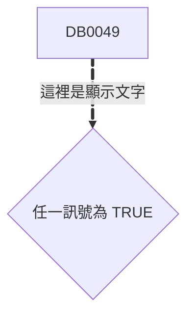
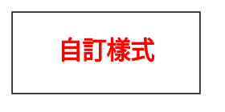
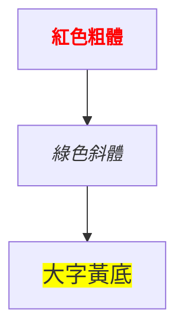
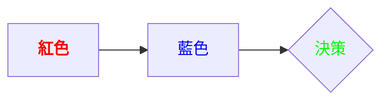
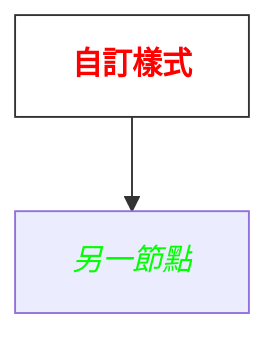

# 前言

在日常程式開發與文件整理中，**Markdown、Mermaid、CSS（以及 HTML 的 <span> 標籤）** 都是常用且實務性很高的技能。本文已將你提供的內容整理、分類並產生為可直接存成 `.md` 的 Markdown 檔案內容，方便放入筆記或 README 中快速查閱與複製使用。

以下內容包含：前言、Markdown 文字顏色與進階控制、Mermaid 與 CSS 的應用、常見疑問、實作範例與速查表。你可直接將整段複製並儲存為檔名（建議）：`markdown-mermaid-css-guide.md`。

---

## Markdown / Mermaid / CSS — 色彩與樣式速查筆記

## 目錄

- [前言](#前言)
  - [Markdown / Mermaid / CSS — 色彩與樣式速查筆記](#markdown--mermaid--css--色彩與樣式速查筆記)
  - [目錄](#目錄)
  - [一、Markdown 進階色彩與文字樣式](#一markdown-進階色彩與文字樣式)
    - [1. Markdown 變色語法及限制](#1-markdown-變色語法及限制)
    - [2. 與字體加粗、斜體的混用](#2-與字體加粗斜體的混用)
  - [二、Mermaid 流程圖與節點造型設定](#二mermaid-流程圖與節點造型設定)
    - [1. 連結顯示文字與動畫範例](#1-連結顯示文字與動畫範例)
    - [2. 節點形狀類型一覽](#2-節點形狀類型一覽)
    - [3. Mermaid 支援色彩類型總結](#3-mermaid-支援色彩類型總結)
  - [三、CSS 顏色語法速查與應用](#三css-顏色語法速查與應用)
    - [1. 顏色名稱（Color Names）](#1-顏色名稱color-names)
    - [2. 十六進位（Hex）](#2-十六進位hex)
    - [3. RGB / RGBA、HSL / HSLA](#3-rgb--rgbahsl--hsla)
    - [4. 進階色彩函數（Color Level 4）](#4-進階色彩函數color-level-4)
    - [5. 速查表（總結）](#5-速查表總結)
  - [四、 vs font（比較與建議）](#四-vs-font比較與建議)
    - [1. 基本差異](#1-基本差異)
    - [2. 語法範例對照](#2-語法範例對照)
    - [3. 使用場景建議](#3-使用場景建議)
    - [4. 替代方案（Mermaid classDef / CSS）](#4-替代方案mermaid-classdef--css)
  - [五、 常用文字樣式與 Mermaid 範例](#五-常用文字樣式與-mermaid-範例)
    - [1. 文字顏色（範例）](#1-文字顏色範例)
    - [2. 粗體 / 斜體](#2-粗體--斜體)
    - [3. 文字大小](#3-文字大小)
    - [4. 其他常用樣式](#4-其他常用樣式)
    - [5. Mermaid 中的應用範例](#5-mermaid-中的應用範例)
    - [6. 注意事項與優先建議](#6-注意事項與優先建議)
  - [六、進階整理 \& 常見疑問集（Q\&A）](#六進階整理--常見疑問集qa)
  - [附錄：完整 Mermaid / HTML 範例程式碼區塊](#附錄完整-mermaid--html-範例程式碼區塊)
  - [結語](#結語)

---

## 一、Markdown 進階色彩與文字樣式

### 1. Markdown 變色語法及限制

- **原生限制**：_Markdown 本身不支援文字變色_。  
- **擴充方式**：可在支援 HTML 的 Markdown 解析器中使用 `span` 並加上 `style` 屬性。例如：

```html
<span style="color:#FCF3CF">這段文字是奶油米色</span>
```

- **實用補充**：
  - 多數支援 HTML 的解析器（如 MkDocs）能正確渲染。
  - 部分平台（如 GitHub 的某些區塊）會移除或忽略內嵌樣式，顯示為純文字。

### 2. 與字體加粗、斜體的混用

- `span` 可包裹 Markdown 的粗體與斜體語法，但在不同解析器行為可能略有差異。範例：

```html
<span style="color:orange">**粗體橘色**</span>
```

- **避免誤區**：
  - 並非所有 Markdown 環境都允許 HTML 控制顏色，先測試相容性。
  - `style` 拼寫錯誤或語法錯誤會導致樣式無效。

---

## 二、Mermaid 流程圖與節點造型設定

### 1. 連結顯示文字與動畫範例

- 範例（需支援進階 Mermaid 語法的環境）：



- 語法拆解：
  - `z1@==>`：自訂連結 ID，可用於後續動畫或 CSS 樣式控制。
  - `|"這裡是顯示文字"|`：在箭頭上顯示說明文字。
  - `{ animate: true }`：指定動畫效果（需 Mermaid 支援）。

### 2. 節點形狀類型一覽

| 語法符號 | 節點外觀 | 範例 |
|---:|:---|:---|
| `[]` | 矩形（方框） | `A[方形節點]` |
| `{}` | 菱形（決策） | `C{菱形節點}` |
| `()` | 圓角矩形 | `B(圓角矩形)` |
| `(( ))` | 圓形 / 橢圓 | `D((圓形))` |
| `[()]` | 圓角 + 內凹 | `E[()內凹圓角]` |
| `[[]]` | 雙層方框 | `F[[雙層框]]` |
| `> ... <` | 新月形 | `G>新月形<` |

- 範例（多形狀）：

```mermaid
flowchart LR
    A[方形]
    B(圓角矩形)
    C{菱形}
    D((圓形))
    E[() 圓角內凹]
    F[[雙層框]]
    G>新月形<
    A --> B --> C --> D --> E --> F --> G
```

### 3. Mermaid 支援色彩類型總結

Mermaid 的 `style` 屬性通常接受以下 CSS 色彩格式：

- 標準顏色名稱：`red`, `blue`, `green` ...
- 十六進位色碼：`#RRGGBB`
- `rgb()` / `rgba()`（部分版本支援半透明）
- `hsl()` / `hsla()`

> 多數情況下可以直接使用 CSS 支援的顏色格式，但渲染結果仍依平台與 Mermaid 版本而異，建議逐一驗證。

---

## 三、CSS 顏色語法速查與應用

### 1. 顏色名稱（Color Names）

- CSS 支援 147 個標準顏色名稱，例如：`red`、`blue`、`green`、`black`、`white`、`orange` 等。

### 2. 十六進位（Hex）

- 常見格式：`#RRGGBB`（或簡寫 `#RGB`）。
- 範例：

```css
color: #ff0000; /* 紅色 */
color: #00ff00; /* 綠色 */
color: #abc;    /* 簡寫，代表 #aabbcc */
```

### 3. RGB / RGBA、HSL / HSLA

- 範例：

```css
color: rgb(255, 0, 0);         /* 紅色 */
color: rgba(255, 0, 0, 0.5);   /* 半透明紅色 */
color: hsl(120, 80%, 40%);     /* HSL 表示 */
color: hsla(120, 80%, 40%, 0.8);/* HSLA 帶透明度 */
```

### 4. 進階色彩函數（Color Level 4）

- 新式函數：`color(display-p3 ...)`, `lab()`, `lch()` 等，通常用於高階色彩管理或特定瀏覽器。

### 5. 速查表（總結）

| 型態 | 實例 | 說明 |
|---:|:---|:---|
| 名稱 | `blue` | 預定義顏色名稱 |
| HEX | `#fc0`, `#ff00aa` | 十六進位 |
| RGB | `rgb(32,66,254)` | 三原色整數 |
| RGBA | `rgba(32,66,254,0.6)` | 含透明度 |
| HSL | `hsl(222,96%,52%)` | 色相 / 飽和 / 亮度 |
| HSLA | `hsla(222,96%,52%,0.2)` | HSL + 透明度 |

---

## 四、<span> vs font（比較與建議）

### 1. 基本差異

| 特性 | `<span>` | `<font>` |
|---:|:---|:---|
| HTML 標準 | 現代 HTML5 標準，建議使用 | 已廢棄（HTML5 不再推薦） |
| 設計目的 | 行內容器（需搭配 CSS） | 字體樣式標籤（舊式） |
| 可控性 | 高（所有 CSS 屬性） | 低（僅字體相關屬性） |
| 相容性 | 現代瀏覽器與工具支援良好 | 逐漸被忽略或移除 |

### 2. 語法範例對照

- `<span>`（推薦）：

```html
<span style="color: red; font-size: 16px;">紅色文字</span>
```

- `<font>`（不推薦，已淘汰）：

```html
<font color="red" size="4">紅色文字</font>
```

### 3. 使用場景建議

- ✅ 使用 `<span>`：現代網站、Mermaid（若支援 HTML）、可維護與可重複使用的樣式（搭配 class/classDef）。
- ❌ 避免 `<font>`：新專案、框架（React/Vue）、需跨平台相容性時。

### 4. 替代方案（Mermaid classDef / CSS）

- Mermaid 可用 `classDef` 來定義重複樣式，並在節點上套用 class：



---

## 五、<span> 常用文字樣式與 Mermaid 範例

### 1. 文字顏色（範例）

```html
<span style="color: red;">紅色文字</span>
<span style="color: #00ff00;">綠色（HEX）</span>
<span style="color: rgb(255, 0, 0);">紅色（RGB）</span>
<span style="color: rgba(255, 0, 0, 0.5);">半透明紅色（RGBA）</span>
```

### 2. 粗體 / 斜體

```html
<span style="font-weight: bold;">粗體文字</span>
<span style="font-style: italic;">斜體文字</span>
<span style="font-weight: bold; font-style: italic;">粗斜體文字</span>
```

### 3. 文字大小

```html
<span style="font-size: 16px;">16像素文字</span>
<span style="font-size: 1.2em;">相對放大 1.2em</span>
<span style="font-size: 120%;">放大 120%</span>
```

### 4. 其他常用樣式

```html
<span style="text-decoration: underline;">底線文字</span>
<span style="text-decoration: line-through;">刪除線文字</span>
<span style="background-color: yellow;">黃底文字</span>
<span style="font-family: Arial, sans-serif;">指定字體</span>
<span style="text-shadow: 1px 1px 2px black;">陰影文字</span>
```

### 5. Mermaid 中的應用範例



### 6. 注意事項與優先建議

- 相容性：某些 Markdown 解析器（例如 GitHub 的某些區塊）會移除 `<span>` 的 style。  
- Mermaid：確保 Mermaid 環境允許 HTML 標籤。  
- 優先使用 `classDef` 或外部 CSS，降低重複工作與維護成本。  
- 若外部主題（theme）覆蓋樣式，必要時可使用 `!important`（謹慎使用）：

```html
<span style="color: red !important;">強制紅色</span>
```

---

## 六、進階整理 & 常見疑問集（Q&A）

Q1. style 可以用哪些顏色格式？  

- A：**CSS 支援的任意格式**（顏色名稱、HEX、RGB/RGBA、HSL/HSLA、以及部分新函數）。注意：部分 Mermaid 版本或平台可能不支援 `rgba()` 或進階函數。

Q2. 除了菱形 `{}` 與方形 `[]`，還有哪些節點形狀？  

- A：常見還有 `()`（圓角矩形）、`(( ))`（圓形/橢圓）、`[()]`（圓角內凹）、`[[]]`（雙層框）、`>...<`（新月形）等。詳見上表與範例。

Q3. Mermaid 的 style 是否可直接套用 CSS 屬性？  

- A：大多數情況可，但仍需視 Mermaid 版本與渲染環境。若遇到限制，建議改用 `classDef` 或外部 CSS。

Q4. Mermaid hybrid / 動畫語法（如 `{ animate: true }`）是否普遍支援？  

- A：這屬於進階或實驗性功能，並非所有 Mermaid 發行版或整合插件都支援，請確認你使用的版本說明與環境。

Q5. 在 Markdown 裡直接寫 `<span>` 有安全或過濾風險嗎？  

- A：某些平台或靜態網站生成器會過濾或移除 inline style，以防 XSS 或樣式污染。建議在正式專案中使用受控的 CSS 與 class。

---

## 附錄：完整 Mermaid / HTML 範例程式碼區塊

- Mermaid 範例（整合文字樣式）：



- Mermaid 使用 classDef 範例：



- HTML 範例（混合 Markdown）：

```html
<p>在支援 HTML 的 Markdown 中：</p>
<span style="color:#FCF3CF; font-weight:bold;">這段文字是奶油米色且粗體</span>
```

---

## 結語

- **重點整理**：若需要文字變色或進階樣式，首選 `<span>` + CSS（或 Mermaid 的 `classDef`），避免使用已廢棄的 `<font>`。  
- **相容性檢核**：實作前請在目標平台（MkDocs、GitHub、Notion、Obsidian、Mermaid 版本）做相容測試。  
- **延伸**：若你需要，我可以：
  - 直接把上述內容產生為 `.md` 檔並提供下載；  
  - 或把檔案轉為 Obsidian 加上 YAML front matter；  
  - 或產生精簡版 README（單頁摘要）。  

如果要我「直接產生 .md 檔並提供下載」，請回覆：  

- 提供檔案下載。
