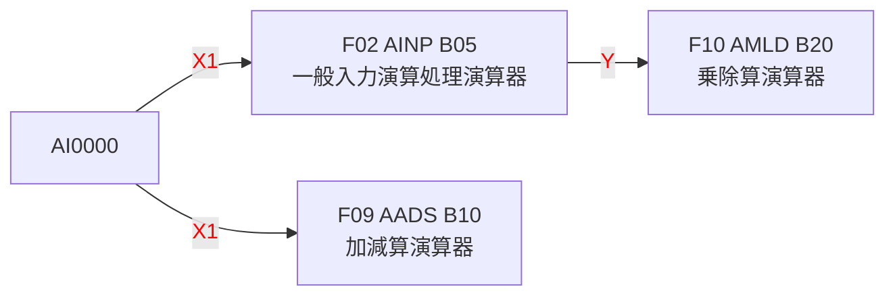
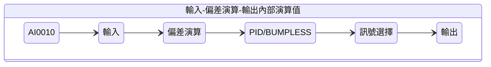
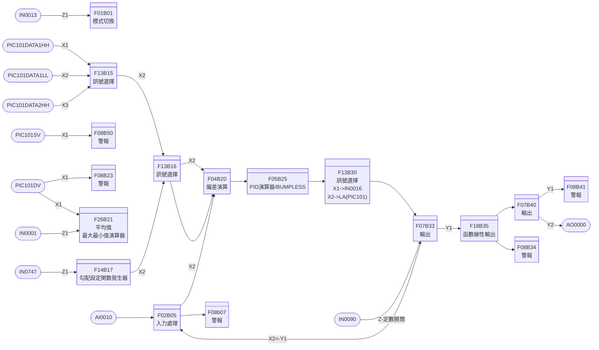

# Loop

---

## LIA 流量監測警報

**解析**:Input訊號處理(依需求處理訊號大小)

```mermaid
flowchart LR
    %% Input Signals
    AI1[AI0000]


    %% Function Blocks
    F02[F02 AINP B05<br>一般入力演算処理演算器]
    F10[F10 AMLD B20<br>乗除算演算器]
    F09[F09 AADS B10<br>加減算演算器]

    %% Connections
    AI1 --> |"X1"| F02
    F02 --> |"Y"| F10

    AI1 --> |"X1"| F09
    linkStyle 0,1,2 color:red;
```

---

```mermaid
stateDiagram-v2 
    %%Input
        AI0010 : AI0010
    state "輸入-偏差演算-輸出內部演算值" as Input1{
        direction LR
        F02B05 : 輸入 
        F04B20 : 偏差演算
        F05B25 : PID/BUMPLESS
        F13B30 : 訊號選擇
        F07B33 : 輸出

        AI0010 --> F02B05
        F02B05 --> F04B20
        F04B20 --> F05B25
        F05B25 --> F13B30
        F13B30 --> F07B33
    }
```

```mermaid
flowchart LR
        F01B01@{ shape: div-rect, label: "F01B01<br>模式切換" }

        F02B05@{ shape: div-rect, label: "F02B05<br>入力處理" }
        F04B20@{ shape: div-rect, label: "F04B20<br>偏差演算 " }
        F05B25@{ shape: div-rect, label: "F05B25<br>PID演算器/BUMPLESS" }
        F13B30@{ shape: div-rect, label: "F13B30<br>訊號選擇<br>X1->IN0016<br>X2->LA(PIC101)"}
        F07B33@{ shape: div-rect, label: "F07B33<br>輸出 " }
        F08B07@{ shape: div-rect, label: "F08b07<br>警報 " }

        F13B15@{ shape: div-rect, label: "F13B15<br>訊號選擇 " }
        F13B16@{ shape: div-rect, label: "F13B16<br>訊號選擇 " }
        F08B23@{ shape: div-rect, label: "F08B23<br>警報 " }

        F18B35@{ shape: div-rect, label: "F18B35<br>函數線性輸出 " }
        F07B40@{ shape: div-rect, label: "F07B40<br>輸出 " }

        F08B50@{ shape: div-rect, label: "F08B50<br>警報 " }
        F08B34@{ shape: div-rect, label: "F08B34<br>警報 " }
        F08B41@{ shape: div-rect, label: "F08B41<br>警報 " }
        F26B21@{ shape: div-rect, label: "F26B21<br>平均值<br>最大最小值演算器 " }
        F14B17@{ shape: div-rect, label: "F14B17<br>勾配設定関数発生器 " }

        PIC101DATA1HH([PIC101DATA1HH])
        PIC101DATA1LL([PIC101DATA1LL])
        PIC101DATA2HH([PIC101DATA2HH])
        IN0747([IN0747])

        PIC101SV([PIC101SV])
        IN0013([IN0013])

        PIC101DV([PIC101DV])
        IN0001([IN0001])


        AI0010([AI0010]) --> F02B05
        F02B05 --> F04B20 & F08B07
        F04B20 --> F05B25
        F05B25 --> F13B30
        F13B30 --> F07B33
        IN0090([IN0090]) -->|Z-定數開關| F07B33
        F07B33 -->|X2<-Y1| F02B05
        F07B33 -->|Y1|F18B35
        F18B35 --> F07B40 & F08B34
        F07B40 -->|Y1| F08B41
        F07B40 -->|Y2| AO0000([AO0000])

        PIC101DATA1HH -->|X1| F13B15
        PIC101DATA1LL -->|X2| F13B15
        PIC101DATA2HH -->|X3| F13B15
        F13B15 -->|X2| F13B16
        IN0747 -->|Z1| F14B17
        F14B17 -->|X2| F13B16
        F13B16 -->|X2|F04B20
        F13B16 -->|X2| F04B20
        
        IN0013 -->|Z1|F01B01
        PIC101SV -->|X1|F08B50
        PIC101DV -->|X1|F08B23 & F26B21
        IN0001 -->|Z1|F26B21    
```
