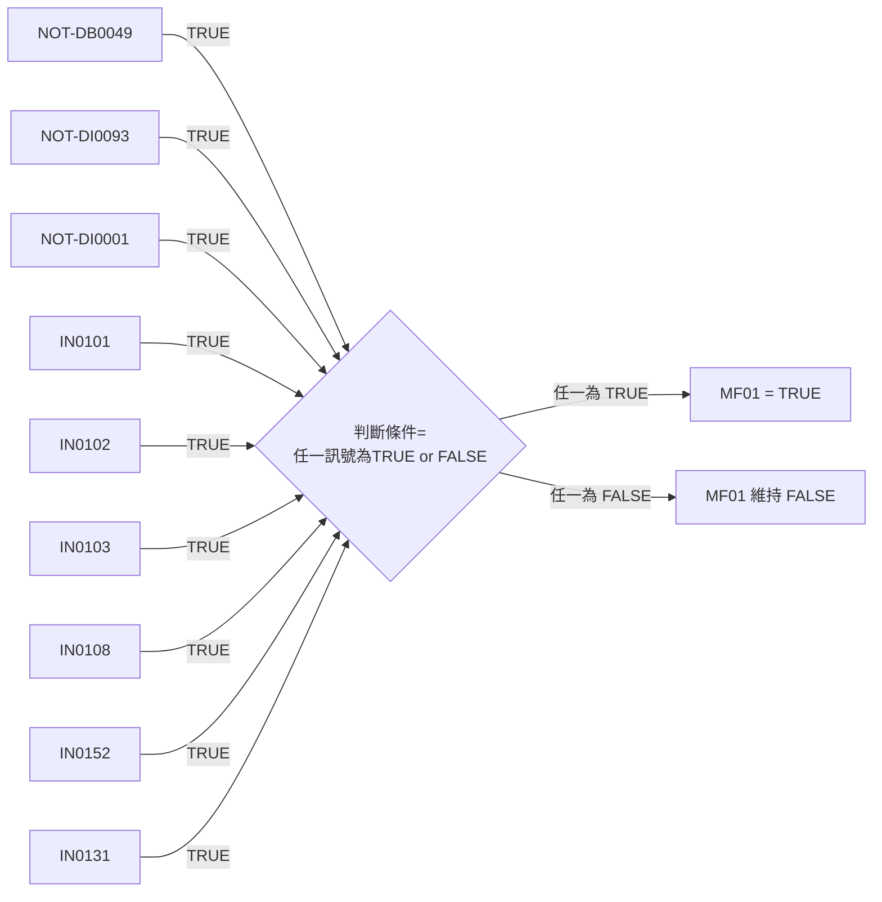

# 語法筆記

## Mermaid流程圖語法

## 顏色設定

style C3 fill:#fff,stroke:#333,stroke-width:1px,color:#ff0000
style C4 fill:#fff,stroke:#333,stroke-width:1px,color:#ff0000

## |TRUE|顏色設定

|"TRUE"|

|"<mark style='background-color:lightgreen'>TRUE</mark>"|

%%斜體+紅字%%
|"TRUE"|

%%白底紅字%%
|TRUE|

%%白底紅字斜體粗體%%
|TRUE|

|"NOT"|

|"NOT"| C1[TD0001 = TRUE Time Count Start]
