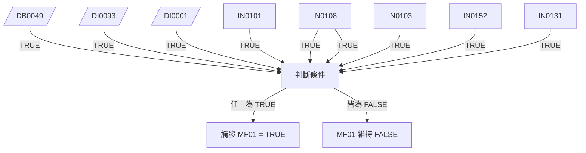

# 我的流程圖

```mermaid
flowchart TD
    A[/DB0049/] -->|TRUE| C[判斷條件]
    B[/DI0093/] -->|TRUE| C
    D[/DI0001/] -->|TRUE| C
    G[IN0101] -->|TRUE| C
    H[IN0102] -->|TRUE| C
    I[IN0103] -->|TRUE| C
    H[IN0108] -->|TRUE| C
    J[IN0152] -->|TRUE| C
    K[IN0131] -->|TRUE| C
    C -->|任一為 TRUE| E[觸發 MF01 = TRUE]
    C -->|皆為 FALSE| F[MF01 維持 FALSE]
```
